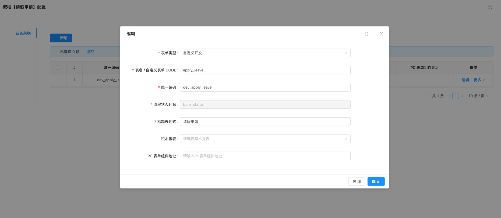

# Flowable 工作流快速上手指南

> 注意：
> - 流程模块中，凡是涉及到用户的，使用username做唯一Key，即用户名，并非id
> - 流程定义中第一个用户任务一定要是申请人节点，节点id必须为start
> - 第一次启动项目会自动生成flw_开头的表，可忽略表不存在的报错，后面再次启动就会正常

## 初始化流程模块

1. 切到 `fun-flowable` 流程引擎功能分支
2. 执行 `./db/jeecgboot-mysql-5.7.sql` 初始化项目基础数据库表结构
3. 执行 `./db/flowable/mysql5.7/flowable-mysql5.7.sql` 初始化流程引擎表结构
4. 执行 `./db/flowable/mysql5.7/flowable.sql` 初始化流程引擎模块基础数据（菜单数据、字典数据等）

## 可自定义流程类型

编辑字典：bpm_process_type

## 快速开发审批流程

### 流程设计

### 在线开发-表单设计

### 流程配置-业务关联

### 生成代码配置菜单

通过代码生成器生成业务代码，并配置菜单后即可使用。
